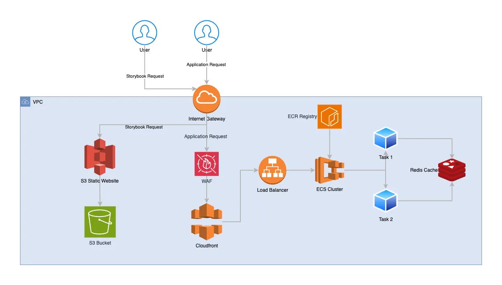

# 🏗️ Enterprise Terraform AWS Infrastructure for Next.js 

This project provides a complete enterprise-grade Terraform setup for deploying a **Next.js** application to **AWS**. It integrates and configures a development cloud architecture with a fully automated deployment pipeline using Terraform and AWS services.



## 🚀 Features

- Automated provisioning of AWS infrastructure
- Deployment of blazity [nextjs-enterprise](https://github.com/Blazity/next-enterprise) frontend boilerplate
- Scalable & secure setup using:
  - **VPC**
  - **Elastic Container Service (ECS)**
  - **Elastic Container Registry (ECR)**
  - **Application Load Balancer**
  - **S3 + CloudFront** for static assets
  - **AWS WAF** (Web Application Firewall)
  - **Redis Cluster** for caching
- CI/CD ready

---

## 🔧 1. Setup Instructions

### 🛠️ Prerequisites

- [Terraform](https://www.terraform.io/downloads)
- [AWS CLI](https://docs.aws.amazon.com/cli/latest/userguide/install-cliv2.html)
- AWS IAM credentials with permissions to provision infrastructure
- Docker (for building the Next.js app container)
- Git

### 📁 Clone the Repository

```bash
git clone https://github.com/tomaszczechowski/terraform-nextjs-enterprise.git
cd terraform-nextjs-enterprise
```

### 🚀 Deployment options

🤖 Automatic Deployment via GitHub Actions

This project includes a GitHub Actions workflow to automate the CI/CD process.

### ✅ Step 1: Configure GitHub Secrets

Navigate to your repository’s **Settings > Secrets and variables > Actions**, and add the following secrets:

- `AWS_ACCESS_KEY_ID`
- `AWS_SECRET_ACCESS_KEY`

These credentials are required for authenticating with AWS during deployment.

### ✅ Step 2: Set Up GitHub Environment Variables

Also, add the following **environment variables** under **Settings > Environments** or directly in your workflow configuration if you're using one:

```env
REDIS_URL=redis://next-enterprise-terraform-dev-redis-cluster.rwzcut.0001.euw2.cache.amazonaws.com:6379
S3_STORYBOOK_BUCKET_NAME=next-enterprise-terraform-storybook
```

### ✅ Step 3: Set AWS region

Also, in terraform `dev/backend.tf` file set AWS region you want to deploy application too.


## 🚀 CI/CD Pipelines

This project includes a comprehensive CI/CD setup with the following pipelines:

- **Check Frontend**  
  Runs linting, unit tests, Prettier formatting, and smoke tests for Storybook.

- **Playwright Tests**  
  Executes end-to-end tests using Playwright.

- **Deploy Stack**  
  Deploys the full infrastructure stack, including the frontend application.

- **Deploy Storybook**  
  Builds and deploys the Storybook UI to the provisioned infrastructure.

- **Destroy Stack**  
  Tears down the deployed infrastructure.

## 🛠️ Setting Up the Production Environment

The codebase includes a pre-configured **development environment**. To create a **production environment**, follow these steps:

1. **Duplicate the Terraform Configuration**
   - Copy the contents of the `terraform/dev` folder.
   - Rename the new folder to `terraform/prod`.

2. **Update Configuration References**
   - Replace all occurrences of `dev` with `prod`.
   - Replace all occurrences of `development` with `production`.

3. **Create the Production Environment in GitHub**
   - Go to your repository:  
     **Settings > Environments > New Environment**
   - Name it `production`.

4. **Add Production Secrets**
   Under **Settings > Secrets and variables > Actions**, and select the `production` environment, add the following secrets for the **production AWS tenant**:

   - `AWS_ACCESS_KEY_ID`
   - `AWS_SECRET_ACCESS_KEY`

5. **Add Production Environment Variables**

   Add the following environment variables to the `production` environment:

   ```env
   REDIS_URL=redis://next-enterprise-terraform-prod-redis-cluster.example.amazonaws.com:6379
   S3_STORYBOOK_BUCKET_NAME=next-enterprise-terraform-storybook-prod
   ```

6. **Duplicate CI/CD Pipelines**
    - Copy the GitHub Actions workflows related to infrastructure and Storybook deployment.
    - Update:
        - Workflow names and environment references to production
        - Any file paths or settings that reference `dev` or `development`

This ensures the production environment is isolated and configured consistently with your development setup.

---
Created with ❤️ by [Tomasz Czechowski](https://github.com/tomaszczechowski)